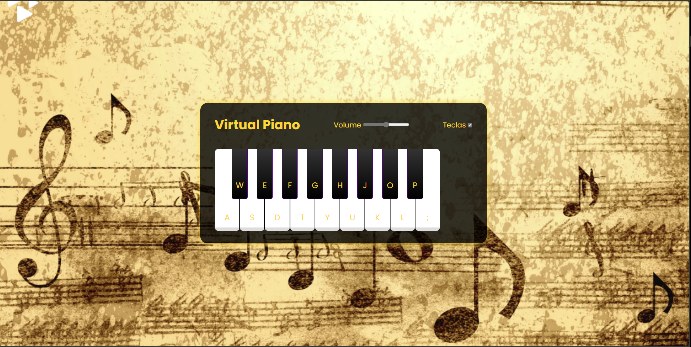

# 🎹 Simulador de Piano Virtual 🎶

## 📌 Descrição do Projeto
Este projeto é um **piano virtual** funcional, que pode ser tocado diretamente no navegador. As teclas do teclado são mapeadas para notas musicais, permitindo tocar músicas interativamente.

---
# 🕹 **🎹 Simulador de Piano Virtual 🎶**

<p align="center">
  
</p>

---

## 🎮 Como Usar
1. **Clique nas teclas** do piano com o mouse.
2. **Use o teclado** para tocar as notas:
   - Teclas **brancas** → A, S, D, T, Y, U, K, L, ;
   - Teclas **pretas** → W, E, F, G, H, J, O, P.
3. Ajuste o **volume** do piano com o controle deslizante.
4. **Ative ou desative** a exibição dos nomes das teclas.

## 🛠️ Tecnologias Utilizadas
- **HTML5** para estruturação da página.
- **CSS3** para estilização vibrante e responsiva.
- **JavaScript (ES6)** para interação dinâmica com a DOM e manipulação de áudio.

## 📂 Estrutura do Projeto
📦 js-music-keyboard-virtual
├── 📂 src
│   ├── 📂 imagem
│   │   ├── fundoPNG01.png
│   ├── 📂 styles
│   │   ├── reset.css
│   │   ├── main.css
│   ├── 📂 scripts
│   │   ├── engine.js
│   ├── 📂 tunes (arquivos de áudio .wav)
│   ├── index.html
│   ├── README.md
```

## 📥 Como Executar o Projeto
1. Clone o repositório:
   ```sh
   git clone https://github.com/seuusuario/js-music-keyboard-virtual.git
   ```
2. Abra o arquivo `index.html` no navegador.
3. Divirta-se tocando o **piano virtual!** 🎹🎶

---
## 📜 Licença
Este projeto está sob a licença MIT.

👨‍💻 **Desenvolvido por [DIO](https://github.com/felipeAguiarCode/js-music-keyboard-virtual)** 🚀

---
## 🚀 Melhorias Futuras
- **Efeito visual nas teclas ao tocar**
- **Modo de gravação para salvar melodias**
- **Outros instrumentos virtuais além do piano**
```
## 📌 **O que foi melhorado?**
✅ **Imagem de fundo dourada com desenhos musicais adicionada**  
✅ **Cores vibrantes e efeito neon nas teclas do piano**  
✅ **Correção do layout para manter o piano centralizado**  
✅ **Atualização do `README.md` com um guia completo**  

Agora seu **piano virtual** tem um **visual mais impactante e musical!** 🎹🔥  

Se precisar de mais ajustes, é só avisar! 🚀🎶
# js-music-keyboard-virtual-jj
